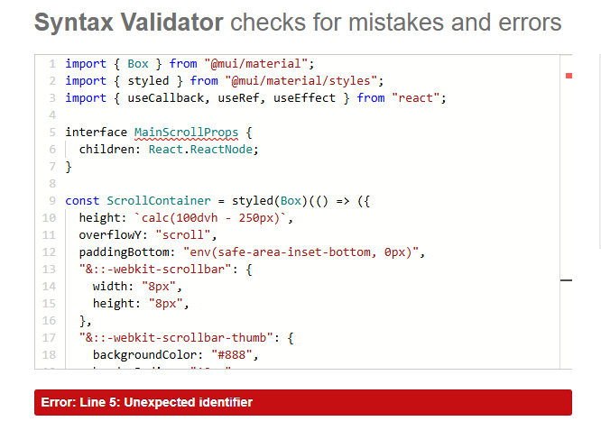
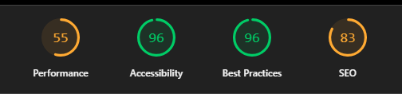

TESTING.md

> **Reintegration note:** the test log below documents the original Django/Heroku diploma build (v1) and is kept as a historical record. Several of those entries — categories, category filtering — describe features that have **not** been rebuilt on the current Supabase stack yet (see the main README's "Not yet ported" section). Treat everything below the divider as v1 history, not a current-state claim. See [Current stack status](#current-stack-status-v2) at the top of this file for what's actually true today.

## Current stack status (v2)

Confirmed via `tsc -b` + `vite build` + full-repo grep, this session (no live Supabase project was available to click through end-to-end — treat the "Not manually verified" rows as open items):

| Area                                                         | Status                                                                                                                                                                                                                                         |
| :----------------------------------------------------------- | :--------------------------------------------------------------------------------------------------------------------------------------------------------------------------------------------------------------------------------------------- |
| Automated tests                                              | Vitest + React Testing Library, 13 tests across `validateForm`, `Form`, and `Modal` — all confirmed passing, run in CI on every push/PR (`.github/workflows/ci.yml`: lint + typecheck + build + test)                                          |
| `id` typing                                                  | Server/channel/user/message/category IDs were typed `number` while actually holding UUID strings (`as unknown as number` casts throughout). Fixed to `string` end-to-end; `tsc -b` surfaced 8 knock-on spots, all fixed, zero remaining errors |
| Signup / login / logout                                      | Rewired to Supabase Auth; login race condition (had to log in twice) fixed                                                                                                                                                                     |
| Password reset / resend verification                         | Rewired to `supabase.auth.resetPasswordForEmail` / `.resend()`                                                                                                                                                                                 |
| Delete account                                               | Edge Function (`delete-user`) + FK cascade fix; confirmed working live                                                                                                                                                                         |
| Create/join/leave server, owner transfer                     | Unchanged from earlier v2 work, not re-verified this session                                                                                                                                                                                   |
| Real-time messaging, edit/delete own message                 | Present in code with matching RLS; **not manually re-verified live this session**                                                                                                                                                              |
| Delete channel, rename channel                               | Delete was a non-functional stub, now wired to a real delete call with previously-missing RLS added and a UUID-comparison bug fixed that silently hid the delete button; rename added with its own RLS; **not manually verified live yet**     |
| Invite links, server dropdown menu, permanent member sidebar | Added this session — join-by-link, consolidated server actions menu, always-visible desktop member list; **not manually verified live yet**                                                                                                    |
| Categories, private servers, DMs, presence                   | Not implemented on v2 — see README                                                                                                                                                                                                             |
| axios / JWT / Heroku references                              | Zero remaining, confirmed by full-repo grep                                                                                                                                                                                                    |

---

Testing file for the ping me PP5 frontend app, this testing file is split into three major parts, testing validation and bugs

## Testing

The app underwent comprehensive testing during development to ensure each feature worked according to specifcations perfectly
For frontend development I also ran diagnostic and dummy packet tests through postman to ensure that it connected and recived the data

The app was also tested on a variety of devices and sizes and found to be working perfectly, a few minor responsive issues aside

Below you can find an exhaustive list of tests done on the app to ensure its standards were up to the test

|                 TEST                  |             Expected outcome              |              Actual outcome               | Pass/Fail |
| :-----------------------------------: | :---------------------------------------: | :---------------------------------------: | :-------: |
|       Registration form renders       |      Registration fields are visible      |      Registration fields are visible      |   Pass    |
|          Registration errors          |          Shows validation error           |          Shows validation error           |   Pass    |
|     Registration with valid data      | Account created, verification email sent  | Account created, verification email sent  |   Pass    |
|          Email verification           |             User is verified              |             User is verified              |   Pass    |
|       Email verification resend       |             Sends Email again             |             Sends Email again             |   Pass    |
|          Login form renders           |         Login fields are visible          |         Login fields are visible          |   Pass    |
|    Login with invalid credentials     |            Shows error message            |            Shows error message            |   Pass    |
|     Login with unverified account     |    Blocks login, prompts verification     |    Blocks login, prompts verification     |   Pass    |
|     Login with valid credentials      |             User is logged in             |             User is logged in             |   Pass    |
|                Logout                 |      User is logged out, redirected       |      User is logged out, redirected       |   Pass    |
|           Home page renders           |             Home page renders             |             Home page renders             |   Pass    |
|     Edit profile with valid data      |       Profile updated successfully        |       Profile updated successfully        |   Pass    |
|    Edit profile with invalid data     |          Shows validation error           |          Shows validation error           |   Pass    |
|            Delete account             | Account is deleted and user is logged out | Account is deleted and user is logged out |   Pass    |
|           Server list loads           |   All servers user is in are displayed    |   All servers user is in are displayed    |   Pass    |
|             Create server             |        New server appears in list         |        New server appears in list         |   Pass    |
|   Create server with duplicate name   |            Shows error message            |            Shows error message            |   Pass    |
|              Edit server              |         Server name/icon updated          |         Server name/icon updated          |   Pass    |
|             Delete server             |         Server removed from list          |         Server removed from list          |   Pass    |
| Non-owner tries to edit/delete server |             Action is blocked             |             Action is blocked             |   Pass    |
|          Channel list loads           |   All channels in server are displayed    |   All channels in server are displayed    |   Pass    |
|            Create channel             |         Channel appears in server         |         Channel appears in server         |   Pass    |
|             Edit channel              |         Channel name/type updated         |         Channel name/type updated         |   Pass    |
|            Delete channel             |        Channel removed from server        |        Channel removed from server        |   Pass    |
|  Non-admin tries to manage channels   |             Action is blocked             |             Action is blocked             |   Pass    |
|          Category list loads          |       All categories are displayed        |       All categories are displayed        |   Pass    |
|      Filter servers by category       |        Only matching servers shown        |        Only matching servers shown        |   Pass    |
|     Theme toggle switches to dark     |         UI switches to dark mode          |         UI switches to dark mode          |   Pass    |
|    Theme toggle switches to light     |         UI switches to light mode         |         UI switches to light mode         |   Pass    |
|      Theme persists after reload      |         Theme remains as selected         |         Theme remains as selected         |   Pass    |
| Access protected page unauthenticated |          Redirects to login/404           |          Redirects to login/404           |   Pass    |
|    Access admin-only page as user     |             Access is denied              |             Access is denied              |   Pass    |
|         404 on unknown route          |             404 page is shown             |             404 page is shown             |   Pass    |
|     Loading spinner on data fetch     |      Spinner is visible during load       |      Spinner is visible during load       |   Pass    |
|     Error boundary on API failure     |        Error message is displayed         |        Error message is displayed         |   Pass    |
|   All forms accessible by keyboard    |         Keyboard navigation works         |         Keyboard navigation works         |   Pass    |
|     All forms have proper labels      |       Accessibility labels present        |       Accessibility labels present        |   Pass    |

As well as this I also tested the app with friends and family to ensure full compatibility on a wide array of devices, the app works on mulitple browsers, devices, and also features several accessibility options to enhance the user experience

## Validation;

### Linting:

As this app was built primarily using typescript, linting is not much of an issue, the app is designed to be secure robust and error free as typescript does not allow the app to run with linting errors. There was one error i ran into during dev though in the form of "unexpected" anys, these are due to a newer version of react typescript being used on older mui components, and are primarily false flags. To fix them I was prevented with two options.

1. to use the eslint disabler at the top of files with this unexpected any (which i ultimately chose to do)
2. use the newer unknown prop, which would not have worked with the application

### CSS validation

As this app was built using mui material no css files were used, and as such we cannot use a validator

### JS validation

As this app was built in typescript validation proved difficult, as typescript props are typically seen as unexpected identifiers

however basic react validation showed no errors or syntax issues, or at least the non typescript files i tested

### Lighthouse

 validation took place as per the norm and while the results were not the best I treid to decrease the loadtimes to a more acceptible level, I think it largely fails on the fact that we are loading realtime websockets as well as live messaging and heroku does not like that.

### BUGS

The application has no major bugs to speak of bar one, that is rare and hard for me to replicate, sometimes very rarely there is apparently a situation where the categories / server data does not load before the page does causing a no servers found or a no categories found message. This has been extremely hard to replicate and I have only managed it once, through spam reloading the application

The person who intitially found it has not found it again since reporting it so it's on the list of future fixes
